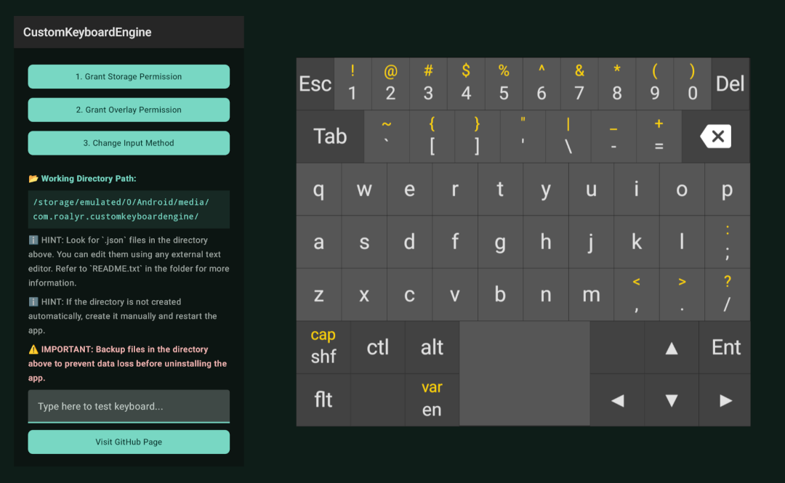
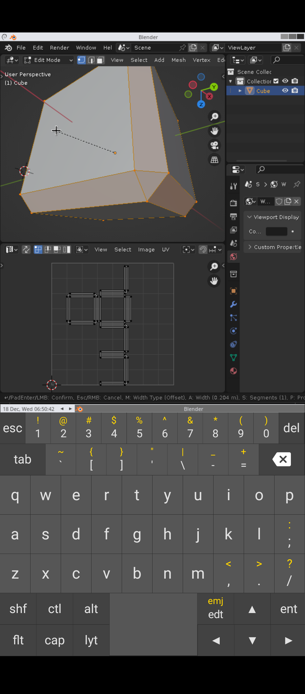
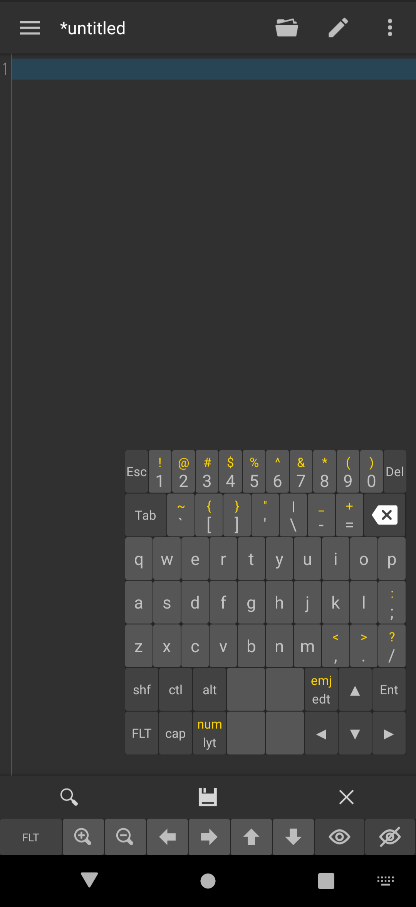
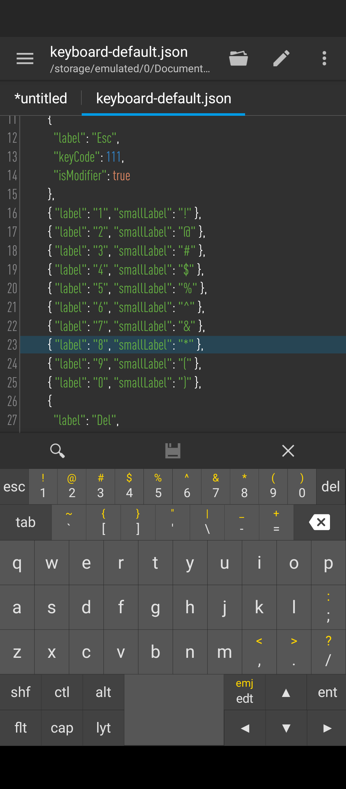
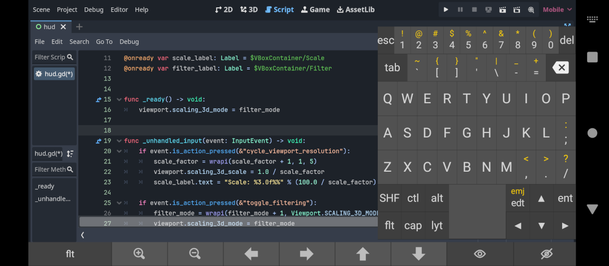

# CustomKeyboard Engine

CustomKeyboard is a flexible and customizable keyboard engine for Android.



---

## Features
- **Multiple Layout Support**: Language layouts and service layouts are dynamically loaded from files.
- **Customizable JSON-Based Layouts**: Define rows, keys, dimensions, and behavior using JSON.
- **Dynamic Reloading**: Layouts can be reloaded when files change.
- **Modifier and Sticky Keys**: Support for Shift, Ctrl, Alt, and Caps Lock behavior.
- **Floating Keyboard**: Optional floating keyboard mode for overlay input.
- **Error Notifications**: Parsing errors are shown in popups for debugging.


---

## Screenshots

### Pressing Ctrl+B in Blender. All generic meta + key combinations work.


---

### Floating keyboard mode with adjustable position, size and visibility.


---

### You can edit .json layouts on the go.


---

### Floating layout in landscape mode in Godot (the reason this app was made).


---

## Folder Structure
(TODO: rename app and folder eventually)

```
New7rowKB/
├── layouts/
│   ├── language-layouts/       # Language-specific layouts
│   │   ├── keyboard-default.json
│   │   ├── keyboard-default-ua.json
│   │   └── ... (other layouts)
│   ├── service-layouts/        # Service-specific layouts
│   │   ├── keyboard-service.json
└── ...
```

---

## JSON Layout Attributes

### 1. **KeyboardLayout**
The root object of the layout file.

| Attribute            | Type          | Description                                      |
|-----------------------|---------------|--------------------------------------------------|
| `rows`               | List<Row>     | List of rows that contain the keyboard keys.     |
| `defaultKeyHeight`   | Float         | Default key height (in DP).                      |
| `defaultKeyWidth`    | Float         | Default key width (percentage of row width).     |
| `defaultRowGap`      | Float         | Default gap between rows (in DP).                |
| `defaultKeyGap`      | Float         | Default gap between keys (percentage or DP).     |

---

### 2. **Row**
Defines a row in the keyboard.

| Attribute            | Type          | Description                                      |
|-----------------------|---------------|--------------------------------------------------|
| `keys`               | List<Key>     | List of keys in this row.                        |
| `rowHeight`          | Float?        | Height of the row (fallback to `defaultKeyHeight`). |
| `rowGap`             | Float?        | Space below this row.                            |
| `defaultKeyWidth`    | Float?        | Default width for keys in this row.              |
| `defaultKeyGap`      | Float?        | Default gap for keys in this row.                |

---

### 3. **Key**
Defines individual key attributes.

| Attribute            | Type          | Description                                      |
|-----------------------|---------------|--------------------------------------------------|
| `keyCode`            | Int           | Primary key code.                                |
| `keyCodeLongPress`   | Int?          | Key code triggered on long press.                |
| `isRepeatable`       | Boolean       | If true, the key repeats when held.              |
| `isModifier`         | Boolean       | If true, the key acts as a modifier (Shift, Ctrl).|
| `isSticky`           | Boolean       | If true, the key toggles its state (e.g., Caps). |
| `label`              | String?       | Primary text label on the key.                   |
| `smallLabel`         | String?       | Small secondary label.                           |
| `icon`               | String?       | Path to the key's drawable icon (e.g., "@drawable/icon_name"). |
| `keyWidth`           | Float?        | Width of the key (fallback to row or layout defaults). |
| `keyHeight`          | Float?        | Height of the key (fallback to row defaults).    |
| `keyGap`             | Float?        | Gap to the next key.                             |
| `x`                  | Float         | Logical X position (calculated automatically).   |
| `y`                  | Float         | Logical Y position (calculated automatically).   |

---

## TODO: List of icons

---

## Custom Keycodes

Custom keycodes are used to trigger special actions. These are defined in the `Constants.kt` file:

| Keycode                          | Value | Description                                               |
|----------------------------------|-------|-----------------------------------------------------------|
| `KEYCODE_CLOSE_FLOATING_KEYBOARD` | -10  | Closes the floating keyboard.                             |
| `KEYCODE_OPEN_FLOATING_KEYBOARD`  | -11  | Opens the floating keyboard.                              |
| `KEYCODE_SWITCH_KEYBOARD_MODE`    | -12  | Switches the keyboard mode.                               |
| `KEYCODE_ENLARGE_FLOATING_KEYBOARD` | -13 | Enlarges the floating keyboard horizontally.              |
| `KEYCODE_SHRINK_FLOATING_KEYBOARD`  | -14 | Shrinks the floating keyboard horizontally.               |
| `KEYCODE_ENLARGE_FLOATING_KEYBOARD_VERT` | -15 | Enlarges the floating keyboard vertically. (TODO)         |
| `KEYCODE_SHRINK_FLOATING_KEYBOARD_VERT`  | -16 | Shrinks the floating keyboard vertically. (TODO)          |
| `KEYCODE_MOVE_FLOATING_KEYBOARD_LEFT`    | -17 | Moves the floating keyboard to the left.                  |
| `KEYCODE_MOVE_FLOATING_KEYBOARD_RIGHT`   | -18 | Moves the floating keyboard to the right.                 |
| `KEYCODE_MOVE_FLOATING_KEYBOARD_UP`      | -19 | Moves the floating keyboard upward.                       |
| `KEYCODE_MOVE_FLOATING_KEYBOARD_DOWN`    | -20 | Moves the floating keyboard downward.                     |
| `KEYCODE_CYCLE_LANGUAGE_LAYOUT`          | -21 | Cycles through available language layouts.                |
| `NOT_A_KEY`                              | -1   | Placeholder for invalid/no key.                           |

For all other standard keycodes, refer to [Android KeyEvent Documentation](https://developer.android.com/reference/android/view/KeyEvent).

---

## Layout Dynamic Reset

Layouts are dynamically reloaded when changes are detected in the layout folders. This is done using file timestamps:

1. **Language Layouts** are loaded from `language-layouts/`.
2. **Service Layouts** are loaded from `service-layouts/`.

If a layout file is updated or a new file is added, the keyboard will reload automatically on the next input method initialization.

---

## Default Layout Copying

Upon every launch, the app copies default layouts into the following folders if they are missing:

- `language-layouts/keyboard-default.json`
- `service-layouts/keyboard-service.json`

If these files are missing or corrupted, fallback layouts are loaded from built-in resources.
You can use those layouts as templates by saving them under different names.

---

## How to Use

1. **Place Layout Files**: Add your JSON files to `language-layouts/` or `service-layouts/`. (TODO: implement custom keycodes for service keyboards).
2. **Edit Layouts**: Customize keys, dimensions, and behaviors in the JSON files.
3. **Restart Keyboard**: The keyboard detects changes and reloads layouts dynamically.
4. **Switch Layouts**: Use the `KEYCODE_CYCLE_LANGUAGE_LAYOUT` key to cycle through language layouts.

---

## Notes

- Modifier keys (Shift, Ctrl, Alt) automatically update key labels to reflect their state.
- Sticky keys (e.g., Caps Lock) toggle their state on press.
- Long-press actions can be defined using `keyCodeLongPress` (TODO: still under development) or `smallLabel`.
- The **Space Key** and similar keys can extend into adjacent rows using custom heights.

---

## Debugging

- Parsing errors are displayed as **error popups** on the screen with details.
- Logs provide information about successfully loaded layouts, file changes, and errors.

---

## Troubleshooting

- **Issue**: Layouts are not updating.  
  **Solution**: Check for syntax errors in the JSON files. Ensure correct file placement.

- **Issue**: Keyboard doesn't show.  
  **Solution**: Verify overlay and storage permissions are granted.

- **Issue**: Keyboard crashes when loading a layout.  
  **Solution**: Check the error popups or logs for parsing issues and fix the JSON structure.

