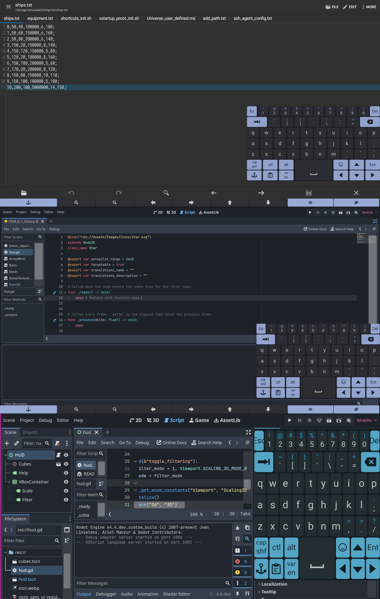

### CustomKeyboardEngine is a flexible and customizable keyboard engine for Android.

---

## Features
- **Multiple Layout Support**: Language layouts and service layouts are dynamically loaded from files.
- **Customizable JSON-Based Layouts**: Define rows, keys, dimensions, and behavior using JSON.
- **Dynamic Reloading**: Layouts can be reloaded when files change.
- **Modifier and Sticky Keys**: Support for Shift, Ctrl, Alt, and Caps Lock behavior.
- **Floating Keyboard**: Optional floating keyboard mode for overlay input.
- **Error Notifications**: Parsing errors are shown in popups for debugging.

---

# [REFERENCE MANUAL](./app/src/main/res/raw/reference.md)
### [Hint: Use Markor text editor to view the document in a more convenient way](https://github.com/gsantner/markor)

---

## Screenshots

